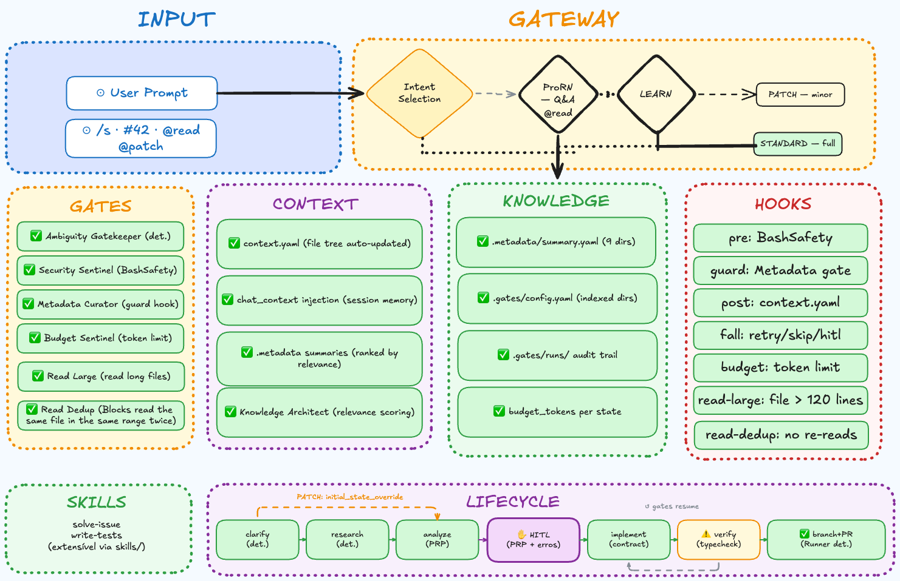

# gates

An agentic coding harness built on [Effect V4](https://github.com/Effect-TS/effect) and the Anthropic SDK. Declare workflows as YAML state machines where every state is a hard gate — the agent must produce verifiable evidence before the runner advances.

Inspired by Jesse Vincent's [Rules and Gates](https://blog.fsck.com/2026/04/07/rules-and-gates/) thesis and built on the concepts from [atomic-gates](https://github.com/lucianfialho/atomic-gates).

---

## Architecture



The system has six layers:

- **Gateway** — classifies intent (ProRN / LEARN / PATCH / STANDARD) via shortcut → heuristic → LLM, zero tokens for the common cases
- **Gates** — PreToolUse enforcement: BashSafety, Metadata, Budget, ReadLarge (blocks full reads > 120 lines), ReadDedup (blocks re-reading the same range)
- **Context** — `context.yaml` file tree, `chat_context` session memory, `.metadata` summaries ranked by relevance
- **Knowledge** — `.metadata/summary.yaml` per indexed directory, `.gates/runs/` audit trail, `budget_tokens` per state
- **Hooks** — pre/guard/post/fall/budget lifecycle hooks, gate blocks returned as tool results (agent recovers, not crashes)
- **Lifecycle** — clarify → research → analyze → HITL → implement → ⚠️ verify → branch+PR, with `initial_state_override` for PATCH and `gates resume` for recovery

---

## The idea

Most coding agents give the model instructions and hope it follows them. That's a rule. Gates is different: each state in a skill has an `output_schema` that the runner validates before advancing. No valid JSON block → retry or HITL. Schema mismatch → retry. The model can't rationalize past a gate.

```
clarify   →  gate: ready=true or return questions
research  →  gate: relevant_dirs + likely_files confirmed
analyze   →  gate: PRP JSON valid, hitl_pause → human approves
implement →  gate: typecheck_passed: true in output
verify    →  gate: passed: true (budget_tokens=30k enforced)
done      →  branch + commit + PR created deterministically
```

Every run is persisted as JSONL in `.gates/runs/`. Every token spent is tracked. The harness was built dogfooding itself.

---

## Install

```bash
git clone https://github.com/lucianfialho/gates
cd gates
bun install
```

Set your API key:

```bash
bun src/index.ts auth set sk-ant-...          # Anthropic (default)
bun src/index.ts auth set minimax <key>       # MiniMax
bun src/index.ts auth set openai <key>        # OpenAI-compatible
```

Configure provider in `.gates/config.yaml`:

```yaml
provider: anthropic   # anthropic | minimax | openai | ollama
model: claude-sonnet-4-6
```

---

## Usage

```bash
# Interactive TUI (recommended)
bun src/index.ts chat

# Direct prompt — Gateway classifies intent automatically
bun src/index.ts "add a --version flag to the CLI"

# Explicit mode shortcuts (in TUI or CLI)
bun src/index.ts "@read how does Runner.ts work?"     # read-only Q&A
bun src/index.ts "@patch fix typo in GatesConfig.ts"  # minimal change, skip research
bun src/index.ts "@standard add budget progress bar"   # full lifecycle

# Skill shortcuts
bun src/index.ts solve-issue "add a --dry-run flag"
bun src/index.ts solve-issue 42          # GitHub issue number
bun src/index.ts write-tests "src/machine/schema_validate.ts"

# Resume a failed run from the state that failed
bun src/index.ts resume <run-id>         # prefix match supported

# Inspect runs
bun src/index.ts stats                   # token spend + cost per run
bun src/index.ts stats --json            # machine-readable
bun src/index.ts logs                    # list last 10 runs
bun src/index.ts logs <runId>            # full event timeline
```

---

## Skills

Skills are YAML state machines in `skills/`. Each state has:

- `agent_prompt` — what the agent is asked to do
- `output_schema` — JSON Schema the output must pass (the gate)
- `on_error: retry|skip|hitl|abort` — what happens when a gate fails
- `budget_tokens` — max tokens for this state (triggers `on_error` if exceeded)
- `timeout_ms` — kill the agent if it runs too long
- `hitl_pause` — pause and ask human before advancing
- `transitions` — where to go next, optionally conditional

**`solve-issue`** — clarify → research → analyze → HITL → implement → verify → branch+PR

**`write-tests`** — analyze → write → verify

### Writing a skill

```yaml
id: my-skill
version: 1
initial_state: analyze
inputs:
  required:
    - name: issue
      type: string
states:
  analyze:
    agent_prompt: |
      Analyze: {{inputs.issue}}
      Use grep() to find relevant sections, then read_lines() for specific ranges.
      Respond with a JSON code block: { "files": [...], "plan": [...] }
    output_schema: schemas/analyze.output.schema.json
    on_error: hitl
    max_retries: 2
    budget_tokens: 60000
    hitl_pause: true
    transitions:
      - to: implement
  implement:
    agent_prompt: |
      Implement. Run typecheck. Only respond when typecheck exits 0.
      Respond with: { "files_changed": [...], "typecheck_passed": true }
    output_schema: schemas/implement.output.schema.json
    budget_tokens: 120000
    transitions:
      - to: done
  done:
    terminal: true
    agent_prompt: ""
```

---

## Token efficiency

Four strategies keep multi-turn agent runs lean:

**read-large gate** — blocks `read()` on files > 120 lines. Forces the agent through `grep(pattern, path) → read_lines(path, start, end)`, reading only the relevant section instead of the full file.

**read-dedup gate** — blocks re-reading the same `path:start-end` range within a state. Once a range is read, the agent must work with what it has.

**Context elision** — `read_lines` and `grep` results older than the current turn are replaced with `[cached: read_lines(path:50-150)]` before each LLM call. Prevents O(N²) growth from history accumulation.

**Budget per state** — each state has an optional `budget_tokens` limit. Exceeded budget triggers `on_error` policy (retry, skip, or hitl), preventing runaway loops.

---

## Gates

| Gate | Trigger | Behavior |
|---|---|---|
| `BashSafety` | Every `bash` call | Blocks force-push to main, `rm` on nonexistent paths, unknown `npm run` scripts |
| `Metadata` | `git commit` | Blocks commit if `.metadata/summary.yaml` is stale |
| `SelectiveContext` | `read`/`write` | Limits file access to relevant paths for the current phase |
| `ReadLarge` | `read()` on file > 120 lines | Returns block message with grep+read_lines instructions |
| `ReadDedup` | `read_lines` or `grep` on already-fetched range | Blocks with "use the earlier result" message |

Gate blocks are returned as **tool results** — the agent receives the message and adjusts its approach. Gates do not crash the state.

---

## Architecture

```
src/
├── agent/Loop.ts           Effect-based agent loop — tool calls, context elision, message history
├── machine/
│   ├── Runner.ts           State machine runner — gates, HITL, budget, resume, persistence
│   ├── Gateway.ts          Intent classification — shortcut → heuristic → LLM, 3-tier
│   ├── Skill.ts            YAML loader + interpolation + transition resolver
│   ├── Persistence.ts      JSONL append-only run storage (state_complete, state_error, ...)
│   └── schema_validate.ts  Minimal JSON Schema subset validator
├── services/
│   ├── LLM.ts              Provider abstraction (Anthropic, OpenAI-compatible, MiniMax, Ollama)
│   ├── Tools.ts            Tool registry — read, read_lines, write, edit, bash, glob, grep, fetch
│   └── GateRegistry.ts     PreToolUse gate enforcement pipeline
├── gates/
│   ├── BashSafety.ts       Blocks dangerous bash patterns
│   ├── Metadata.ts         Blocks stale commits
│   ├── ContextScope.ts     Selective file access by phase
│   ├── ReadLarge.ts        Forces grep+read_lines on large files
│   └── ReadDedup.ts        Blocks re-reading same range within a state
├── context/
│   ├── ProjectContext.ts   Project snapshot for context injection
│   ├── ResearchContext.ts  .metadata summaries ranked by relevance
│   └── RelevantPaths.ts    Tracks files relevant to the current task
└── auth/Auth.ts            BYOK — env var or ~/.local/share/gates/auth.json
```

All layers are Effect V4 services. Dependency injection via `Context.Service` + `Layer`. Error channels are typed — `Effect<A, GateError | RunnerError | LLMError, Deps>`.

---

## References

- [Rules and Gates](https://blog.fsck.com/2026/04/07/rules-and-gates/) — Jesse Vincent's thesis that this harness implements
- [atomic-gates](https://github.com/lucianfialho/atomic-gates) — the Claude Code plugin this project grew out of
- [effect](https://github.com/Effect-TS/effect) — the TypeScript runtime powering the agent loop
- [MemGPT](https://arxiv.org/abs/2310.08560) — the memory hierarchy concept behind read-large + read-dedup

---

## License

MIT
