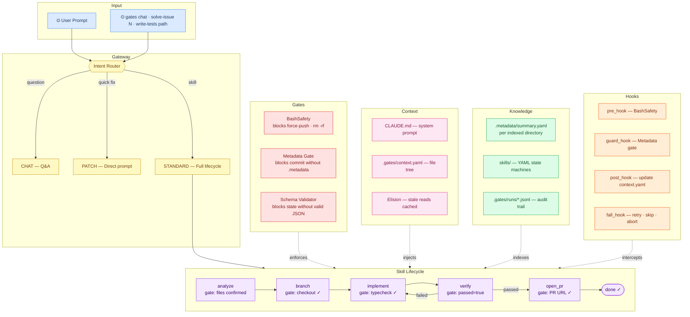

# gates

An agentic coding harness built on [Effect V4](https://github.com/Effect-TS/effect) and the Anthropic SDK. Declare workflows as YAML state machines where every state is a hard gate — the agent must produce verifiable evidence before the runner advances.

Inspired by Jesse Vincent's [Rules and Gates](https://blog.fsck.com/2026/04/07/rules-and-gates/) thesis and built on the concepts from [atomic-gates](https://github.com/lucianfialho/atomic-gates).

---

## Architecture



---

## The idea

Most coding agents give the model instructions and hope it follows them. That's a rule. Gates is different: each state in a skill has an `output_schema` that the runner validates before advancing. No valid JSON block → retry. Schema mismatch → retry. The model can't rationalize past a gate.

```
analyze  →  gate: confirmed file paths in output
implement →  gate: typecheck_passed: true in output  
verify   →  gate: passed: true in output
done
```

Every run is persisted as JSONL in `.gates/runs/`. Every token spent is tracked. The harness was built dogfooding itself.

---

## Install

```bash
git clone https://github.com/lucianfialho/gates
cd gates
bun install
```

Set your Anthropic API key:

```bash
bun src/index.ts auth set sk-ant-...
# or
export ANTHROPIC_API_KEY=sk-ant-...
```

---

## Usage

```bash
# Direct prompt
bun src/index.ts "what files are in src/?"

# Run a skill (state machine)
bun src/index.ts solve-issue "add a --dry-run flag to the CLI"
bun src/index.ts write-tests "src/machine/schema_validate.ts"

# Inspect runs
bun src/index.ts stats          # token spend + cost per run
bun src/index.ts logs           # list last 10 runs
bun src/index.ts logs <runId>   # full event timeline

# Help
bun src/index.ts help
```

---

## Skills

Skills are YAML state machines in `skills/`. Each state has:

- `agent_prompt` — what the agent is asked to do
- `output_schema` — JSON Schema the output must pass (the gate)
- `on_error: retry|skip|abort` — what happens when a gate fails
- `transitions` — where to go next, optionally conditional

**`solve-issue`** — analyze → implement → verify  
Takes an issue description, confirms affected files, implements the change, runs typecheck, verifies independently.

**`write-tests`** — analyze → write → verify  
Takes a file path, reads it, generates tests with full coverage, runs them with `bun test`.

### Writing a skill

```yaml
id: my-skill
version: 1
initial_state: analyze
inputs:
  required:
    - name: issue
      type: string
states:
  analyze:
    agent_prompt: |
      Analyze: {{inputs.issue}}
      GATE CONDITION: confirm file paths exist before responding.
      Respond with a JSON code block: { "files": [...], "plan": [...] }
    output_schema: schemas/analyze.output.schema.json
    on_error: retry
    max_retries: 2
    transitions:
      - to: implement
  implement:
    agent_prompt: |
      Implement. Run typecheck. Only respond when typecheck exits 0.
      Respond with: { "files_changed": [...], "typecheck_passed": true }
    output_schema: schemas/implement.output.schema.json
    transitions:
      - to: done
  done:
    terminal: true
    agent_prompt: ""
```

---

## Tools available to the agent

| Tool | Description |
|---|---|
| `bash` | Run shell commands (optional timeout) |
| `read` | Read a file |
| `read_lines` | Read a specific line range from a file |
| `write` | Write a file |
| `write_lines` | Append lines to a file |
| `edit` | Replace exact string in a file (unique match required) |
| `glob` | List files matching a pattern |
| `grep` | Search files for a pattern |
| `fetch` | HTTP requests |

---

## Token efficiency

Two strategies reduce the cost of multi-turn agent runs:

**Elision** — file-read results older than 3 turns are replaced with `[file cached: path]` before each LLM call. The conversation history stays lean.

**Context snapshot** — after each run, `.gates/context.yaml` is updated with the project's file tree and recent commits. The runner injects only the files relevant to the current task into the system prompt.

---

## Architecture

```
src/
├── agent/Loop.ts          Effect-based agent loop (tool calls, message history)
├── machine/
│   ├── Runner.ts          State machine runner with gate enforcement
│   ├── Skill.ts           YAML skill loader + interpolation + transition resolver
│   ├── Persistence.ts     JSONL append-only run storage
│   └── schema_validate.ts Minimal JSON Schema subset validator
├── services/
│   ├── LLM.ts             Anthropic SDK wrapper (claude-sonnet-4-6)
│   ├── Tools.ts           Tool registry and handlers
│   └── GateRegistry.ts    PreToolUse gate enforcement
├── gates/
│   └── BashSafety.ts      Blocks dangerous bash patterns
├── context/
│   └── ProjectContext.ts  Project snapshot for context injection
└── auth/Auth.ts           BYOK — env var or ~/.local/share/gates/auth.json
```

All layers are Effect V4 services. Dependency injection via `Context.Service` + `Layer`.

---

## References

- [Rules and Gates](https://blog.fsck.com/2026/04/07/rules-and-gates/) — Jesse Vincent's thesis that this harness implements
- [atomic-gates](https://github.com/lucianfialho/atomic-gates) — the Claude Code plugin this project grew out of
- [effect](https://github.com/Effect-TS/effect) — the TypeScript runtime powering the agent loop
- [obra/superpowers](https://github.com/obra/superpowers) — the skill corpus that inspired the YAML skill format

---

## License

MIT
