# gates — Architecture

```mermaid
flowchart TB
  classDef input    fill:#dbeafe,stroke:#3b82f6,color:#1e3a5f
  classDef gateway  fill:#fef9c3,stroke:#ca8a04,color:#713f12
  classDef gates    fill:#fee2e2,stroke:#dc2626,color:#7f1d1d
  classDef context  fill:#fce7f3,stroke:#db2777,color:#831843
  classDef knowledge fill:#dcfce7,stroke:#16a34a,color:#14532d
  classDef hooks    fill:#ffedd5,stroke:#ea580c,color:#7c2d12
  classDef skill    fill:#f3e8ff,stroke:#9333ea,color:#3b0764

  %% ── INPUT ──────────────────────────────────────────────────
  subgraph INPUT["  Input  "]
    UP["⊙ User Prompt"]
    SC["⊙ gates chat / solve-issue N / write-tests path"]
  end

  %% ── GATEWAY ─────────────────────────────────────────────────
  subgraph GATEWAY["  Gateway  "]
    IEM{{"Intent Router\n(chat detects mode)"}}
    QA["CHAT\nQ&A only"]
    PATCH["PATCH\nDirect prompt → agent"]
    STANDARD["STANDARD\nFull skill lifecycle"]
  end

  UP --> IEM
  SC --> IEM
  IEM -->|"question / explain"| QA
  IEM -->|"quick fix"| PATCH
  IEM -->|"solve-issue / write-tests"| STANDARD

  %% ── GATES (Roles) ───────────────────────────────────────────
  subgraph GATES["  Gates  "]
    direction TB
    BS["BashSafety Gate\nblocks force-push · rm -rf · bad npm scripts"]
    MG["Metadata Gate\nblocks git commit without .metadata/summary.yaml"]
    SV["Schema Validator\nblocks state transition without valid JSON output"]
  end

  %% ── CONTEXT ──────────────────────────────────────────────────
  subgraph CONTEXT["  Context  "]
    direction TB
    CM["CLAUDE.md\nProject docs injected as system prompt"]
    CY[".gates/context.yaml\nAuto-updated file tree + exports + git log"]
    EL["Tool-result Elision\nStale reads → [file cached] after 3 turns"]
  end

  %% ── KNOWLEDGE ────────────────────────────────────────────────
  subgraph KNOWLEDGE["  Knowledge  "]
    direction TB
    META[".metadata/summary.yaml\nPer indexed directory — agent-maintained"]
    SKILLDIR["skills/ index\nsolve-issue · write-tests · custom"]
    RUNS[".gates/runs/*.jsonl\nAppend-only audit trail per run"]
  end

  %% ── HOOKS ────────────────────────────────────────────────────
  subgraph HOOKS["  Hooks  "]
    direction TB
    PRE["pre_hook\nBashSafety intercepts Bash tool calls"]
    GUARD["guard_hook\nMetadata gate intercepts git commit"]
    POST["post_hook\nUpdate context.yaml after run"]
    FAIL["fall_hook\non_error: retry · skip · abort"]
  end

  %% ── SKILL LIFECYCLE ──────────────────────────────────────────
  subgraph LIFECYCLE["  Skill Lifecycle — solve-issue  "]
    direction LR
    S1["analyze\n─────\ngate: confirmed\nfile paths in JSON"]
    S2["branch\n─────\ngate: git branch\n--show-current ✓"]
    S3["implement\n─────\ngate: typecheck\npassed: true"]
    S4["verify\n─────\ngate: passed=true\nindependent check"]
    S5["open_pr\n─────\ngate: PR URL\nin output"]
    DONE(["done ✓"])

    S1 --> S2 --> S3 --> S4
    S4 -->|passed| S5 --> DONE
    S4 -->|failed| S3
  end

  %% ── CONNECTIONS ──────────────────────────────────────────────
  STANDARD --> LIFECYCLE
  GATES     -.->|enforces| LIFECYCLE
  CONTEXT   -.->|injects into system prompt| LIFECYCLE
  KNOWLEDGE -.->|indexes + audits| LIFECYCLE
  HOOKS     -.->|intercepts| LIFECYCLE

  %% ── STYLES ───────────────────────────────────────────────────
  class UP,SC input
  class IEM,QA,PATCH,STANDARD gateway
  class BS,MG,SV gates
  class CM,CY,EL context
  class META,SKILLDIR,RUNS knowledge
  class PRE,GUARD,POST,FAIL hooks
  class S1,S2,S3,S4,S5,DONE skill
```

## Layer mapping

| Image | gates |
|---|---|
| Input → User Prompt | `gates chat` / `gates solve-issue "N"` |
| Gateway → Intent Mode | Chat router detects Q&A vs skill |
| PATCH mode | Direct `gates "quick fix"` prompt |
| STANDARD mode | `solve-issue` skill: analyze→branch→implement→verify→PR |
| Roles → Security Sentinel | `BashSafety` gate (PreToolUse) |
| Roles → Documentation Curator | `Metadata` gate (blocks commit without .metadata) |
| Roles → Ambiguity Gatekeeper | `schema_validate` — blocks state without valid JSON |
| Context → Knowledge | `.gates/context.yaml` — auto file tree + exports |
| Context → Budget Control | Tool-result elision (stale reads → [cached]) |
| Knowledge → Domain Index | `.metadata/summary.yaml` per indexed directory |
| Knowledge → Skill Index | `skills/` YAML state machines |
| Hooks → pre_hook | BashSafety intercepts Bash calls |
| Hooks → guard_hook | Metadata gate intercepts git commit |
| Hooks → fall_hook | `on_error: retry\|skip\|abort` in skill.yaml |
| Lifecycle → Approval Gate | Schema gate blocks state transition without evidence |
| Lifecycle → Implement by Contract | `implement` state: typecheck must exit 0 |
| Lifecycle → Audit | `.gates/runs/*.jsonl` JSONL per run |
