# gates — Architecture

## Onde estamos no diagrama de referência

```mermaid
flowchart TB
  classDef done    fill:#dcfce7,stroke:#16a34a,color:#14532d
  classDef partial fill:#fef9c3,stroke:#ca8a04,color:#713f12
  classDef missing fill:#fee2e2,stroke:#dc2626,color:#7f1d1d
  classDef hitl    fill:#fdf4ff,stroke:#a855f7,color:#581c87

  subgraph INPUT["  Input  "]
    UP["✅ User Prompt"]
    SC["✅ /s /solve /test · #42"]
    MD["❌ @read @patch @standard"]
  end

  subgraph GATEWAY["  Gateway  "]
    IEM{{"✅ classifyExplicit()\n(determinístico)"}}
    QA["✅ CHAT\nfreeform agent"]
    PATCH["🔶 PATCH\nfreeform ≈ patch"]
    STANDARD["✅ STANDARD\nsolve-issue skill"]
  end

  UP & SC --> IEM
  MD -.->|"não implementado"| IEM
  IEM -->|"/s ou número"| STANDARD
  IEM -->|"resto"| QA

  subgraph ROLES["  Roles / Gates  "]
    direction TB
    AG["✅ Ambiguity Gatekeeper\nclarify state (agora determinístico)"]
    BS["✅ Security Sentinel\nBashSafety gate (PreToolUse)"]
    MG["✅ Documentation Curator\nMetadata gate (blocks git commit)"]
    IS["❌ Interface Steward\nnot implemented"]
    KA["❌ Knowledge Architect\nnot implemented"]
  end

  subgraph CONTEXT["  Context  "]
    direction TB
    CY["✅ context.yaml\nfile tree + exports + git log"]
    DET["✅ Direct Reading when scope clear\ndeterministic research (regex extract)"]
    BC["🔶 Budget Control\ntoken tracking mas sem enforcement"]
    KE["❌ Knowledge Escalation\nnot implemented"]
  end

  subgraph KNOWLEDGE["  Knowledge  "]
    direction TB
    META["✅ .metadata/summary.yaml\nper indexed directory"]
    CFG["✅ .gates/config.yaml\nindexed_directories"]
    KG["❌ KNOWLEDGE_GRAPH.md\nroot node — not implemented"]
    DI["❌ Domain Index\nnot implemented"]
  end

  subgraph HOOKS["  Hooks  "]
    direction TB
    PRE["✅ pre_hook\nBashSafety intercepts tool calls"]
    GUARD["✅ guard_hook\nMetadata gate on git commit"]
    POST["✅ post_hook\ncontext.yaml update after run"]
    FAIL["✅ fall_hook\non_error: retry·skip·abort·hitl"]
    SCA["❌ Sca_hook / Knowledge Extraction\nnot implemented"]
  end

  subgraph LIFECYCLE["  Lifecycle — solve-issue  "]
    direction LR

    CLR["✅ clarify\n(determinístico se contexto rico)"]
    RES["✅ research\n(determinístico se files no chat)"]
    ANA["✅ analyze\nPRP — root_cause + changes + acceptance"]

    HITL{{"🔴 HITL Gate\nEXISTE mas UX quebrado\nmostra JSON bruto\nhumano não consegue ler"}}

    IMP["✅ implement\nImplement by Contract"]
    VER["✅ verify\ntypecheck only (lightweight)"]
    DONE(["✅ branch + PR\n(determinístico pelo Runner)"])

    CLR --> RES --> ANA --> HITL
    HITL -->|"Y — aprovado"| IMP
    HITL -->|"N — aborta"| DONE
    IMP --> VER --> DONE
  end

  STANDARD --> LIFECYCLE
  ROLES -.->|enforces| LIFECYCLE
  CONTEXT -.->|injects| LIFECYCLE
  KNOWLEDGE -.->|indexes| LIFECYCLE
  HOOKS -.->|intercepts| LIFECYCLE

  class UP,SC,IEM,QA,STANDARD,AG,BS,MG,CY,DET,META,CFG,PRE,GUARD,POST,FAIL,CLR,RES,ANA,IMP,VER,DONE done
  class PATCH,BC,KG done
  class MD,IS,KA,KE,DI,SCA missing
  class HITL hitl
```

## Legenda

| Status | Significa |
|---|---|
| ✅ Verde | Implementado e funcionando |
| 🔶 Amarelo | Parcialmente implementado |
| ❌ Vermelho | Não implementado |
| 🔴 Roxo | Implementado mas com bug crítico de UX |

## Gap mais crítico agora

O **HITL Gate** é o único ponto vermelho num sistema que deveria ser o centro do controle humano. O humano aprova um JSON ilegível em vez de um plano claro. Isso é o que torna o "Approval Gate" inútil na prática.

## O que implementar a seguir

1. **HITL legível** — mostrar o PRP formatado (issue, summary, files, changes, acceptance)
2. **Mode selection** — `@read`, `@patch`, `@standard` como shortcuts (hoje só `/s`)
3. **Knowledge Architect** — navegação pelo knowledge graph via .metadata
